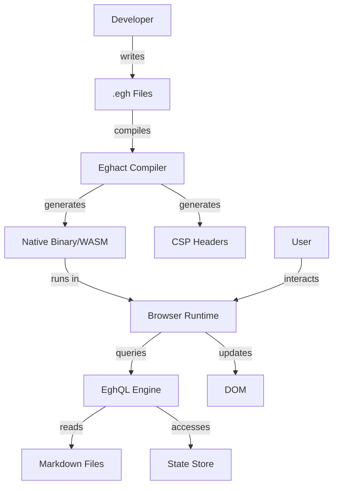

# Eghact Framework Threat Model

## Executive Summary

This document provides a comprehensive threat model for the Eghact framework using STRIDE methodology. It identifies potential security threats across all framework components and defines mitigation strategies.

## System Overview

### Architecture Components



### Trust Boundaries

1. **Developer Environment ↔ Build System**
2. **Build Output ↔ Production Server**
3. **Client Browser ↔ Server API**
4. **Framework Code ↔ User Code**
5. **EghQL Engine ↔ Data Sources**

## STRIDE Analysis

### 1. Spoofing Identity

#### Threat: Developer Account Compromise
- **Component**: Build system, package registry
- **Description**: Attacker gains access to developer credentials
- **Impact**: Malicious code injection into framework
- **Likelihood**: Medium
- **Mitigation**:
  - Enforce 2FA for all maintainers
  - Sign all releases with GPG
  - Automated security scanning on all PRs
  - Restricted npm publish access

#### Threat: User Session Hijacking
- **Component**: Runtime state management
- **Description**: Attacker steals session tokens
- **Impact**: Unauthorized access to user accounts
- **Likelihood**: Medium
- **Mitigation**:
  - Secure, httpOnly, sameSite cookies
  - Session rotation on privilege escalation
  - Automatic session timeout
  - Device fingerprinting

### 2. Tampering with Data

#### Threat: Build Artifact Tampering
- **Component**: Compiled binaries, WASM modules
- **Description**: Attacker modifies compiled output
- **Impact**: Malicious code execution
- **Likelihood**: Low
- **Mitigation**:
  - Reproducible builds
  - Checksum verification
  - Code signing certificates
  - Subresource Integrity (SRI)

#### Threat: State Manipulation
- **Component**: Reactive state store
- **Description**: Unauthorized state modifications
- **Impact**: Application logic bypass
- **Likelihood**: Medium
- **Mitigation**:
  - State validation rules
  - Immutable state updates
  - State change audit log
  - Permission-based state access

#### Threat: EghQL Injection
- **Component**: EghQL query engine
- **Description**: Malicious query injection
- **Impact**: Data breach, unauthorized access
- **Likelihood**: High
- **Mitigation**:
  - Parameterized queries only
  - Query whitelist for production
  - Strict query parser
  - Runtime query validation

### 3. Repudiation

#### Threat: Action Denial
- **Component**: User actions, state changes
- **Description**: User denies performing actions
- **Impact**: Dispute resolution issues
- **Likelihood**: Low
- **Mitigation**:
  - Comprehensive audit logging
  - Cryptographic signatures on critical actions
  - Immutable audit trail
  - Legal compliance logging

### 4. Information Disclosure

#### Threat: Source Map Exposure
- **Component**: Production builds
- **Description**: Source maps reveal implementation
- **Impact**: Reverse engineering, vulnerability discovery
- **Likelihood**: Medium
- **Mitigation**:
  - Disable source maps in production
  - Secure source map server
  - Access control for debug builds

#### Threat: Error Message Leakage
- **Component**: Runtime error handling
- **Description**: Stack traces expose internals
- **Impact**: Information gathering for attacks
- **Likelihood**: High
- **Mitigation**:
  - Generic error messages for users
  - Detailed logs server-side only
  - Error monitoring service
  - Sanitized error responses

#### Threat: Markdown Data Exposure
- **Component**: EghQL markdown queries
- **Description**: Unauthorized access to .md files
- **Impact**: Data breach
- **Likelihood**: Medium
- **Mitigation**:
  - File access permissions
  - Query authorization layer
  - Encrypted sensitive markdown
  - Data classification system

### 5. Denial of Service

#### Threat: Compiler Resource Exhaustion
- **Component**: .egh file compiler
- **Description**: Malicious templates consume resources
- **Impact**: Build system DoS
- **Likelihood**: Medium
- **Mitigation**:
  - Compilation timeouts
  - Resource limits
  - Template complexity limits
  - Build queue management

#### Threat: Reactive Loop Bombs
- **Component**: Reactive state system
- **Description**: Infinite update loops
- **Impact**: Browser freeze, CPU exhaustion
- **Likelihood**: High
- **Mitigation**:
  - Update cycle detection
  - Maximum update depth
  - Batched updates
  - Performance monitoring

#### Threat: EghQL Query Bombs
- **Component**: Query engine
- **Description**: Complex queries consuming resources
- **Impact**: Server/client DoS
- **Likelihood**: Medium
- **Mitigation**:
  - Query complexity scoring
  - Execution timeouts
  - Result size limits
  - Query rate limiting

### 6. Elevation of Privilege

#### Threat: Component Permission Bypass
- **Component**: Component security boundaries
- **Description**: Child component accesses parent state
- **Impact**: Unauthorized data access
- **Likelihood**: Medium
- **Mitigation**:
  - Strict component isolation
  - Explicit prop passing only
  - Runtime permission checks
  - Component sandboxing

#### Threat: Native Code Escape
- **Component**: Rust/WASM runtime
- **Description**: Escape from WASM sandbox
- **Impact**: Host system compromise
- **Likelihood**: Low
- **Mitigation**:
  - WASM security best practices
  - Limited native API access
  - Capability-based security
  - Regular security audits

## Attack Trees

### XSS Attack Tree
```
Goal: Execute Arbitrary JavaScript
├── Direct Script Injection
│   ├── Via User Input
│   │   └── Mitigation: Auto-escaping
│   └── Via Component Props
│       └── Mitigation: Prop validation
├── DOM-based XSS
│   ├── Via URL Parameters
│   │   └── Mitigation: URL sanitization
│   └── Via Local Storage
│       └── Mitigation: Storage validation
└── Stored XSS
    ├── Via Markdown Content
    │   └── Mitigation: Markdown sanitization
    └── Via Database
        └── Mitigation: Output encoding
```

### Authentication Bypass Tree
```
Goal: Unauthorized Access
├── Session Hijacking
│   ├── Cookie Theft
│   │   └── Mitigation: Secure cookies
│   └── Session Fixation
│       └── Mitigation: Session regeneration
├── Credential Attacks
│   ├── Brute Force
│   │   └── Mitigation: Rate limiting
│   └── Credential Stuffing
│       └── Mitigation: 2FA, anomaly detection
└── Token Manipulation
    ├── JWT Tampering
    │   └── Mitigation: Strong signing
    └── Token Replay
        └── Mitigation: Token expiration
```

## Risk Matrix

| Threat | Likelihood | Impact | Risk Level | Priority |
|--------|------------|--------|------------|----------|
| EghQL Injection | High | High | Critical | P0 |
| XSS via Templates | High | High | Critical | P0 |
| Reactive Loop DoS | High | Medium | High | P1 |
| State Tampering | Medium | High | High | P1 |
| Session Hijacking | Medium | High | High | P1 |
| Compiler DoS | Medium | Medium | Medium | P2 |
| Info Disclosure | Medium | Medium | Medium | P2 |
| Build Tampering | Low | High | Medium | P2 |
| Native Escape | Low | Critical | Medium | P2 |
| Repudiation | Low | Low | Low | P3 |

## Security Controls

### Preventive Controls
1. **Input Validation**: All user inputs validated at boundaries
2. **Output Encoding**: Automatic context-aware encoding
3. **Authentication**: Multi-factor authentication support
4. **Authorization**: Role-based access control (RBAC)
5. **Secure Defaults**: Security features enabled by default

### Detective Controls
1. **Security Monitoring**: Real-time threat detection
2. **Audit Logging**: Comprehensive activity logs
3. **Anomaly Detection**: ML-based behavior analysis
4. **Integrity Monitoring**: File and state integrity checks

### Corrective Controls
1. **Incident Response**: Documented response procedures
2. **Patch Management**: Rapid security update process
3. **Rollback Capability**: Quick reversion mechanisms
4. **Data Recovery**: Backup and restore procedures

## Testing Strategy

### Security Testing Types

1. **Static Analysis (SAST)**
   - CodeQL for code patterns
   - Semgrep for security rules
   - ESLint security plugin

2. **Dynamic Analysis (DAST)**
   - OWASP ZAP scanning
   - Burp Suite testing
   - Custom fuzzing

3. **Dependency Scanning**
   - Snyk vulnerability scanning
   - npm audit automation
   - License compliance

4. **Penetration Testing**
   - Annual third-party pentest
   - Continuous bug bounty
   - Red team exercises

## Incident Response Plan

### Response Phases

1. **Detection**
   - Automated alerts
   - User reports
   - Security monitoring

2. **Containment**
   - Isolate affected systems
   - Disable compromised features
   - Preserve evidence

3. **Eradication**
   - Remove malicious code
   - Patch vulnerabilities
   - Update security controls

4. **Recovery**
   - Restore normal operations
   - Verify system integrity
   - Monitor for reoccurrence

5. **Lessons Learned**
   - Post-incident review
   - Update threat model
   - Improve controls

## Compliance Mapping

### OWASP Top 10 Coverage
- A01:2021 - Broken Access Control ✓
- A02:2021 - Cryptographic Failures ✓
- A03:2021 - Injection ✓
- A04:2021 - Insecure Design ✓
- A05:2021 - Security Misconfiguration ✓
- A06:2021 - Vulnerable Components ✓
- A07:2021 - Authentication Failures ✓
- A08:2021 - Software and Data Integrity ✓
- A09:2021 - Security Logging Failures ✓
- A10:2021 - Server-Side Request Forgery ✓

## Review Schedule

- **Quarterly**: Threat model review
- **Monthly**: Security metrics review
- **Weekly**: Vulnerability scan review
- **Daily**: Security alert triage

---

*Document Version: 1.0*
*Last Updated: 2025-06-23*
*Next Review: 2025-09-23*
*Owner: Eghact Security Team*